# Flour Bestandsoptimierung
Ein plattformunabhängiges Python-Tool mit grafischer Oberfläche zur automatisierten Bestandsanalyse, Bedarfsberechnung und interaktiven PDF-Generierung für Filialbetriebe mit dem Kassensystem "Flour".

Das Tool soll helfen, die Lagerhaltung zu optimieren und Kapitalbindung durch Überbestellungen zu vermeiden. Bestell- und Umverteilungsprozesse bei mehreren Filialen sollen dadurch weitgehend automatisiert werden.

---

## Funktionen

- Intelligente Bedarfsanalyse: Berechnet den realen Bedarf basierend auf historischen Verkäufen unter Berücksichtigung von Mindestbeständen und optionalen Zukunftspuffern.
- Hare-Niemeyer-Umlagerung: Auf Grundlage der historischen Verkaufsstatistik aller Filialen werden die Überbestände einer Filiale proportional und mathematisch fair auf die anderen verteilt.
- Interaktiver PDF-Export: Bestell- und Umbuchungsvorschläge werden als digital ausfüllbare PDF-Datei mit Checkboxen erstellt, um den Bestellfortschritt im Auge zu behalten.
- Effizient sortierte Checkliste: Bestellvorschläge werden nach Lieferanten segmentiert. Innerhalb der Segmente werden Artikel erst nach Hersteller, dann alphabetisch gelistet.
- Privacy-by-Design: Alle Berechnungen und Datenverarbeitungen laufen zu 100% offline und lokal auf dem ausführenden System. Es werden keine Daten an externe API's oder Cloud-Dienste geschickt.

## Anleitung
### Installation
Die aktuellsten Versionen für Windows und Linux sind [hier](https://github.com/issuingemu/Flour-Bestandsoptimierung/releases) oder direkt rechts neben dem Text unter "Releases" zu finden.
#### Windows
- Lade die Datei "Bestands_Tool.exe" herunter und lege sie in einem dedizierten Ordner ab.
- Da das Programm keine offizielle Signatur hat, zeigt Windows Defender beim ersten Start evtl. eine Warnung. Klicke auf "Weitere Informationen" und "Trotzdem ausführen", um das Programm zu starten.

#### Linux
- Lade die Datei "Bestands_Tool-Linux" herunter und lege sie in einem dedizierten Ordner ab.
- Klicke mit der rechten Maustaste auf eine freie Fläche im Ordner und klicke auf "Im Terminal öffnen".
- Kopiere den folgenden Befehl, füge ihn im Terminal ein und bestätige mit Enter.

```
chmod +x Bestands_Tool-Linux
```
  
### Anwendung
#### Quelldateien herunterladen
Klicke in der Flour-Oberfläche auf das Zahnrad und wähle "Export".

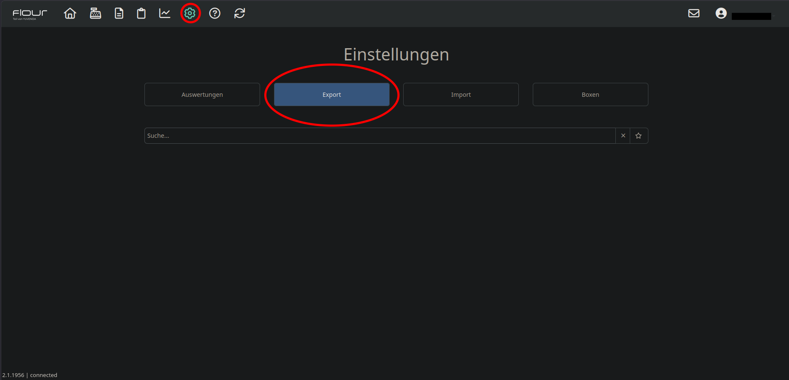

##### Artikelstammdaten
Klicke auf das Drop-Down Menü und wähle "Artikel".

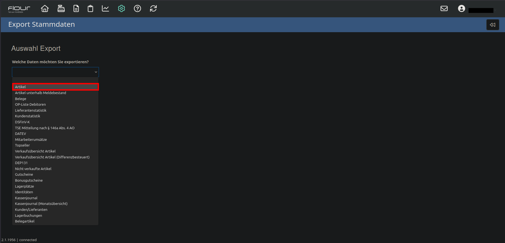

Aktiviere die Option "Inklusive kalkulierte Bestände". Klicke dann auf "Export ausführen".

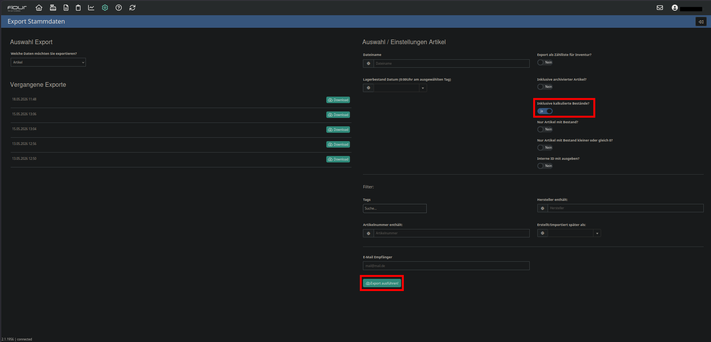

Sobald die Datei fertig erstellt wurde, kannst du sie im Menü links oder direkt unter dem "Export ausführen" Button herunterladen.

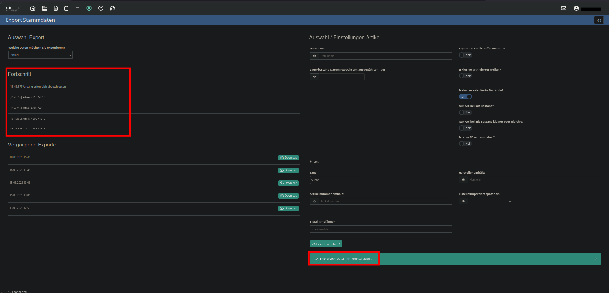

##### Verkaufsdaten
Gehe wieder zu Export und wähle im Drop-Down Menü "Verkaufsübersicht Artikel".

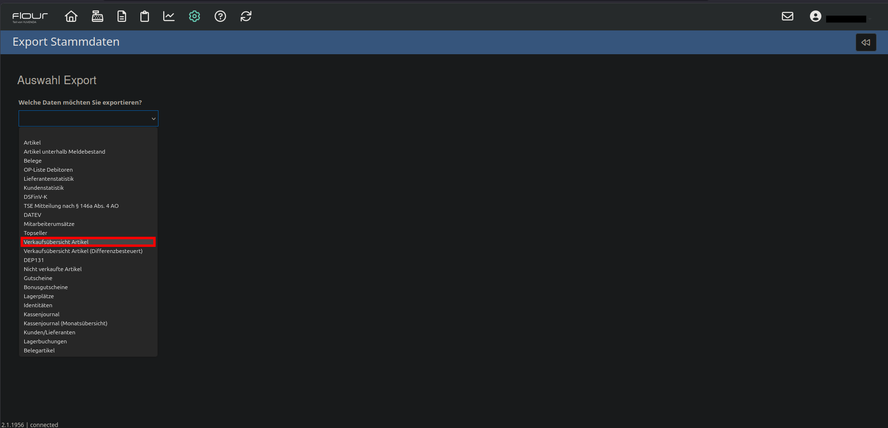

###### Artikelfilter
Hier gibt es einige Optionen, nach Warengruppen zu filtern. Beispielsweise können Artikeltags angegeben werden, um nur Artikel zu exportieren, die diese Tags hinterlegt haben.
**ACHTUNG:** Wenn mehrere Tags angegeben werden, landen am Ende nur Artikel in der Datei, die **alle angegebenen Tags gleichzeitig nutzen**.
###### Zeitraum & Bedarfsrechnung
Das Tool nutzt das hier gewählte Startdatum zur Berechnung deines Verkaufszeitraums. Die verkaufte Menge aus genau dieser Spanne bestimmt den zukünftigen Basisbedarf.
- **Beispiel:** Setzt du das Feld „Datum von“ auf exakt eine Woche in die Vergangenheit und Artikel A wurde in dieser Woche 8-mal verkauft, definiert das Programm den Grundbedarf für diesen Artikel auf 8 Stück.

Wenn die Artikelfilter gesetzt sind und ein Zeitraum bestimmt wurde, klickst du wieder auf "Export starten", wartest bis die Datei fertig ist und lädst sie herunter.

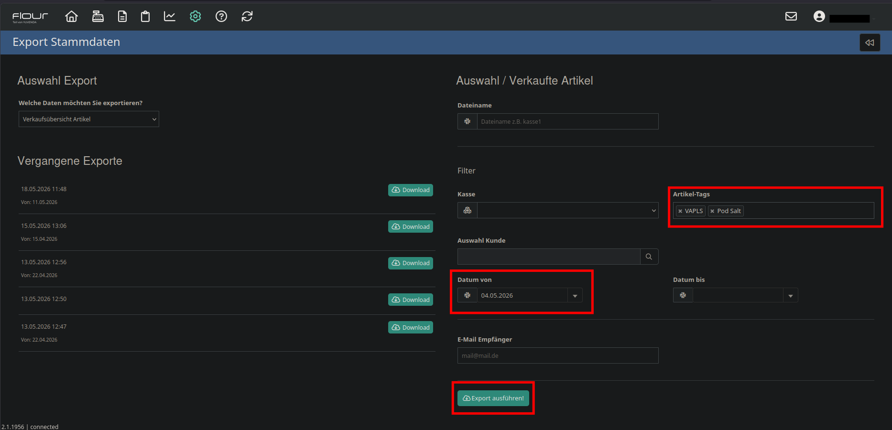

#### Anwendung des Tools
Das Tool durchsucht beim Start automatisch den Ordner in dem es liegt nach den zwei aktuellsten CSV Dateien mit "articles" und "articlessold" im Namen. Benenne die gerade heruntergeladenen Dateien also **nicht** um, sondern lege sie so wie sie sind in dem Ordner ab, in dem auch das Programm liegt.


Wenn du das Tool startest, solltest du ganz oben zwei grüne Zeilen sehen, die bestätigen, dass die Dateien gefunden wurden. Darunter liegen die zwei Tabs, aus denen du wählst, ob du eine Liste für Bestellungen generieren willst, oder Überbestände aus einem Lager an die restlichen verteilen möchtest.

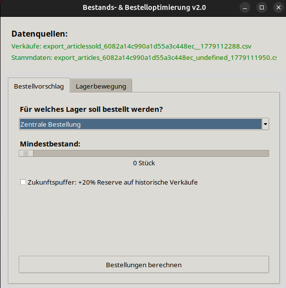

##### Bestellvorschlag

Für einen Bestellvorschlag bleibst du in dem vorausgewählten Reiter. Du musst die folgenden Einstellungen vornehmen:
- Wähle im **Drop-Down Menü** das Lager, für das ein Bestellvorschlag erstellt werden soll. Für einen Vorschlag für alle Lager gemeinsam, wähle "**Zentrale Bestellung**".
- Bestimme mit dem **Slider** einen **Mindestbestand**.
- Setze bei Bedarf einen **Haken** bei der Option "**Zukunftspuffer**", um den errechneten **Grundbedarf** um **20% zu erhöhen**, um Nullbestände durch Mehrverkäufe zu vermeiden.

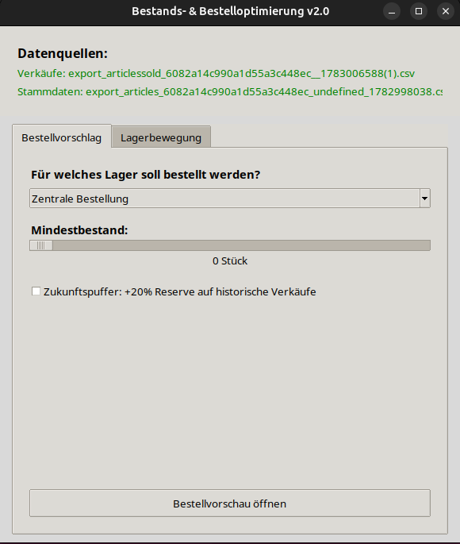

Wenn du für alle Optionen eine Auswahl getroffen hast, klicke auf "**Bestellungen berechnen**", um den Bestellvorschlag zu generieren. Er wird als bearbeitbare PDF-Datei automatisch in dem Ordner abgelegt, in dem sich auch das Tool befindet.

Der fertige Bestellvorschlag sieht dann so aus:
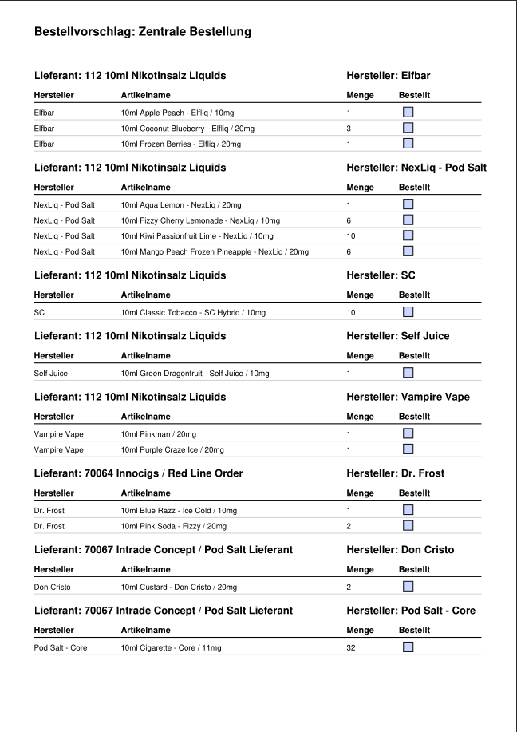


##### Lagerbewegung

Manchmal kann es sinnvoll sein, den Warenbestand zwischen den Filialen aufzuteilen, um Kapitalbindung entgegenzuwirken. Wenn eine Produktkategorie in Filiale A selten verkauft wird, während Filiale B mit den selben Artikeln hohe Verkaufszahlen erwirtschaftet, sollten Überbestände aus Lager A an Lager B geschickt werden.  
Das Tool kann dabei helfen, Artikel zu identifizieren, bei denen ein Überbestand vorliegt und diese logisch an die anderen Lager zu verteilen. Für diese Rechnung werden Daten aus den selben Dateien genutzt, die für einen Bestellvorschlag exportiert werden.

**WICHTIG:** Beim Exportieren der Verkaufsübersicht **keinen Filter bei "Kasse" setzen!** Die Verkaufsdaten **aller Filialen** sind **essenziell**, um eine Optimale Verteilung der Artikel berechnen zu können.

Für einen Lagerbewegungsvorschlag klickst du auf den Reiter "**Lagerbewegung**". Hier wählst du aus den folgenden Optionen:
- Wähle im **Drop-Down Menü** das Lager, aus dem Überbestände gefunden werden sollen und das die Artikel später verschickt.
- Bestimme mit dem **Slider** einen **Mindestbestand**, der auf jeden Fall im Versandlager bleiben soll.
- Setze bei Bedarf einen **Haken** bei der Option "**Zukunftspuffer**", wenn du davon ausgehst, dass die Verkäufe im Versandlager in der nächsten Zeit wieder steigen. Damit behält die Filiale 20% mehr Artikel, als sie über den Zeitraum verkauft hat, den die exportierte Verkaufsübersicht dokumentiert.

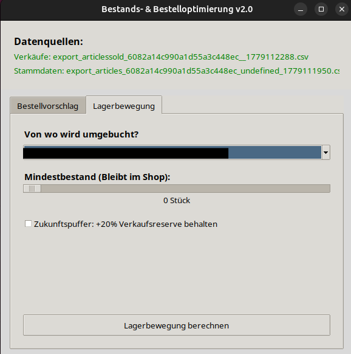

Klicke jetzt auf "**Lagerbewegung berechnen**", um einen Vorschlag zur Umverteilung der erkannten Überbestände zu erhalten. Die Datei wird im selben Ordner abgelegt, in dem sich auch das Tool befindet.  
Der fertige Vorschlag sieht so aus:
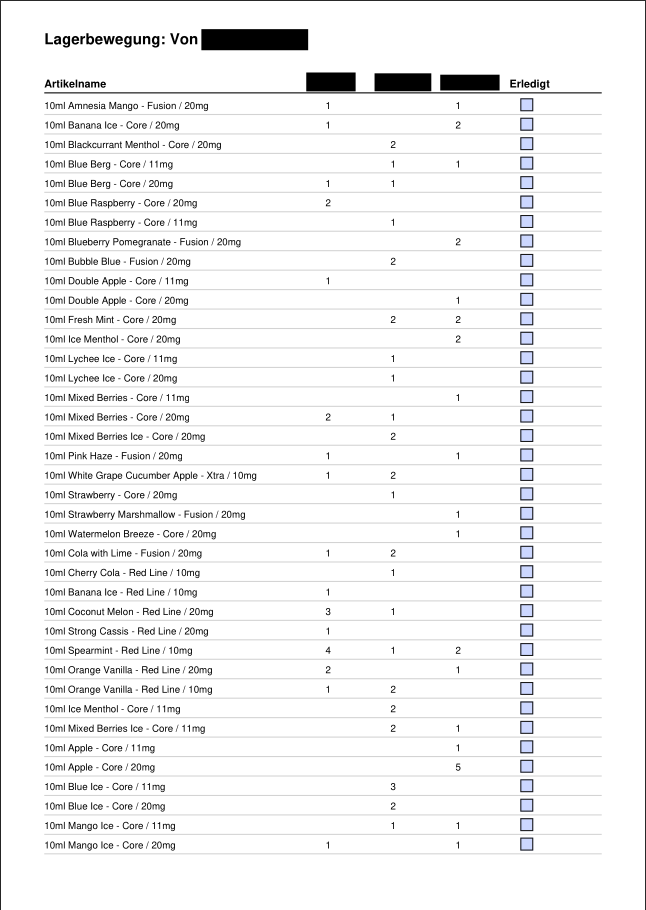


# 📦 Flour Bestandsoptimierung

Ein plattformunabhängiges Python-Tool mit grafischer Oberfläche zur automatisierten Bestandsanalyse, Bedarfsberechnung und interaktiven PDF-Generierung für Filialbetriebe mit dem Kassensystem **Flour**.

Das Tool unterstützt aktiv dabei, die Lagerhaltung zu optimieren und unnötige Kapitalbindung durch Überbestellungen zu vermeiden. Bestell- und Umverteilungsprozesse zwischen mehreren Filialen werden hiermit weitgehend automatisiert.

---

## ✨ Funktionen

* **Intelligente Bedarfsanalyse:** Berechnet den realen Bedarf basierend auf historischen Verkäufen unter Berücksichtigung von Mindestbeständen und optionalen Zukunftspuffern.
* **Proportionale Lagerumverteilung:** Auf Grundlage der historischen Verkaufsstatistik aller Filialen werden Überbestände einer Filiale über das *Hare-Niemeyer-Verfahren* mathematisch fair und proportional auf die Standorte mit ungedecktem Bedarf verteilt.
* **Interaktiver PDF-Export:** Bestell- und Umbuchungsvorschläge werden als digital ausfüllbare PDF-Dateien mit integrierten Checkboxen erstellt, um den Bearbeitungsfortschritt vor Ort im Auge zu behalten.
* **Optimierte Checklisten:** Bestellvorschläge werden übersichtlich nach Lieferanten segmentiert. Innerhalb dieser Abschnitte werden die Artikel sauber nach Hersteller und anschließend alphabetisch gelistet.
* **Privacy-by-Design (Lokaler Datenschutz):** Alle Berechnungen und Datenverarbeitungen laufen zu 100 % offline auf dem lokalen System. Es werden keinerlei Daten an externe APIs oder Cloud-Dienste übertragen.

---

## 📖 Anleitung

### 🛠️ Installation & Start

Die aktuellsten Versionen für Windows und Linux findest du direkt auf der rechten Seite unter **[Releases](https://github.com/issuingemu/Flour-Bestandsoptimierung/releases)**.

#### Windows
1. Lade die Datei `Bestands_Tool.exe` herunter und lege sie in einem eigenen Ordner ab.
2. Starte das Programm per Doppelklick.
3. *Hinweis zu Microsoft SmartScreen:* Da das Programm im Workflow automatisiert gebaut und nicht kostenpflichtig zertifiziert ist, zeigt Windows beim ersten Start eventuell einen Warnbildschirm. Klicke einfach auf **„Weitere Informationen“** und anschließend auf **„Trotzdem ausführen“**.

#### Linux
1. Lade die Datei `Bestands_Tool-Linux` herunter und speichere sie in einem eigenen Ordner.
2. Mache die Datei einmalig ausführbar:
   * **Über die GUI:** Rechtsklick auf die Datei ➔ *Eigenschaften* ➔ *Zugriffsrechte* ➔ Haken bei *„Datei als Programm ausführen erlauben“* aktivieren.
   * **Über das Terminal:** Öffne das Terminal im entsprechenden Ordner und führe folgenden Befehl aus:
     ```bash
     chmod +x Bestands_Tool-Linux
     ```
3. **Starten (Ubuntu 24.04+ / GNOME):** Mache einen Rechtsklick auf die Datei und wähle **„Als Programm ausführen“** (ein reiner Doppelklick wird von moderneren Linux-Systemen standardmäßig blockiert).

---

### 📊 Anwendung

#### 1. Quelldateien aus Flour exportieren
Klicke in deiner Flour-Oberfläche auf das Zahnrad-Symbol und wähle den Punkt **„Export“**.


##### Artikelstammdaten exportieren
1. Klicke auf das Drop-down-Menü und wähle **„Artikel“**.


2. Aktiviere unbedingt die Option **„Inklusive kalkulierte Bestände“**.
3. Klicke anschließend auf **„Export ausführen“**.


Sobald die Datei generiert wurde, kannst du sie im linken Menü oder direkt über den Button unterhalb von „Export ausführen“ herunterladen.


##### Verkaufsdaten exportieren
Wechsle erneut in den Export-Bereich und wähle im Drop-down-Menü den Punkt **„Verkaufsübersicht Artikel“**.


* **Artikelfilter (Optional):** Hier findest du Optionen, um nach bestimmten Warengruppen zu filtern. Es können beispielsweise *Artikel-Tags* angegeben werden, um nur gezielte Sortimente auszugeben.  
  ⚠️ **ACHTUNG:** Wenn du mehrere Tags angibst, landen am Ende nur Artikel in der Datei, die **alle angegebenen Tags gleichzeitig** besitzen.
* **Zeitraum & Bedarfsrechnung („Datum von“):** Das Tool nutzt das hier gewählte Startdatum zur Berechnung deines Verkaufszeitraums. Die verkaufte Menge aus genau dieser Spanne bestimmt den zukünftigen Basisbedarf.
  * *Beispiel:* Setzt du das Feld **„Datum von“** auf exakt eine Woche in die Vergangenheit und Artikel A wurde in dieser Woche 8-mal verkauft, definiert das Programm den Grundbedarf für diesen Artikel auf 8 Stück.

Wenn deine Artikelfilter gesetzt und der Zeitraum bestimmt ist, klicke auf **„Export ausführen“**, warte die Verarbeitung ab und lade die Datei herunter.


#### 2. Ausführung des Tools
Das Tool durchsucht beim Start automatisch das Verzeichnis, in dem es liegt, nach den zwei aktuellsten CSV-Dateien, die `articles` und `articlessold` im Namen tragen. Benenne die heruntergeladenen Dateien daher **nicht** um, sondern lege sie einfach direkt im selben Ordner ab, in dem sich das Programm befindet.


Nach dem Start des Tools bestätigen dir zwei grüne Zeilen am oberen Rand, dass die benötigten Dateien erfolgreich erkannt wurden. Darunter stehen dir zwei Reiter (Tabs) zur Verfügung.


##### Registerkarte: Bestellvorschlag
Für einen Bestellvorschlag bleibst du im vorausgewählten Reiter und nimmst folgende Einstellungen vor:
* Wähle im **Drop-Down-Menü** das gewünschte Lager aus. Für eine gemeinsame Bestellung über alle Filialen hinweg wählst du **„Zentrale Bestellung“**.
* Bestimme über den **Slider** einen gewünschten **Mindestbestand**.
* Setze bei Bedarf einen Haken beim **„Zukunftspuffer“**, um den errechneten **Grundbedarf pauschal um 20 % zu erhöhen**. Dies hilft, Lieferengpässe oder unerwartete Mehrverkäufe abzufedern.


Wenn alle Optionen eingestellt sind, klicke auf **„Bestellungen berechnen“**. Der fertige Bestellvorschlag wird als interaktive PDF-Datei im Programmordner abgelegt.

Der fertige Bestellvorschlag sieht wie folgt aus:


##### Registerkarte: Lagerbewegung
Um Totbeständen und unnötiger Kapitalbindung entgegenzuwirken, ist es sinnvoll, Warenbestände gezielt zwischen den Filialen umzuverteilen. Wenn eine Produktkategorie in Filiale A stagniert, in Filiale B jedoch stark nachgefragt wird, berechnet das Tool eine mathematisch optimale Umlagerung.

⚠️ **WICHTIG:** Beim Export der Verkaufsübersicht in Flour darf hierfür **kein Filter bei „Kasse“ gesetzt werden**. Die Verkaufsdaten **aller** Filialen sind zwingend erforderlich, um die Verteilung korrekt zu berechnen.

Klicke im Tool auf den Reiter **„Lagerbewegung“** und triff deine Auswahl:
* Wähle im **Drop-Down-Menü** das abgebende Lager aus, aus dem die Überbestände entnommen und verschickt werden sollen.
* Bestimme mit dem **Slider** den **Mindestbestand**, der zwingend im Versandlager verbleiben muss.
* Setze bei Bedarf einen Haken beim **„Zukunftspuffer“**, falls du erwartest, dass die Verkäufe im Versandlager zeitnah wieder steigen. Die Filiale behält dann 20 % mehr Artikel, als sie im dokumentierten Zeitraum rechnerisch benötigt hätte.


Klicke auf **„Lagerbewegung berechnen“**, um den Umverteilungsvorschlag zu generieren. Die PDF-Datei wird 
