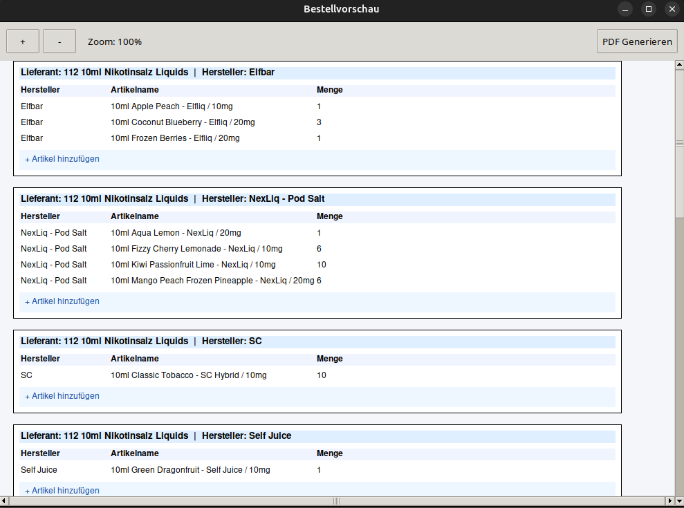
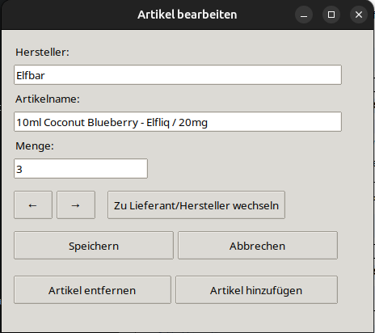

# 📦 Flour Bestandsoptimierung

Ein plattformunabhängiges Python-Tool mit grafischer Oberfläche zur automatisierten Bestandsanalyse, Bedarfsberechnung und interaktiven PDF-Generierung für Filialbetriebe mit dem Kassensystem **Flour**.

Das Tool unterstützt aktiv dabei, die Lagerhaltung zu optimieren und unnötige Kapitalbindung durch Überbestellungen zu vermeiden. Bestell- und Umverteilungsprozesse zwischen mehreren Filialen werden hiermit weitgehend automatisiert.

---

## ⚡️ Problemerkennung
Im manuellen Betriebsalltag führten die herkömmlichen Bestell- und Umverteilungsprozesse zu zwei wesentlichen Herausforderungen:

- **Hoher Zeitaufwand:** Die Abwicklung von Bestellungen basierte auf den grafischen Verkaufsstatistiken im Flour-User-Interface (UI). Jeder Artikel musste einzeln aufgerufen werden, um historische Verkäufe mit aktuellen Lagerbeständen abzugleichen. Die geschätzten Bestellmengen wurden anschließend manuell in einen Discord-Kanal übertragen. Noch zeitintensiver gestaltete sich die filialübergreifende Umverteilung von Überbeständen: Hierfür mussten zunächst die Statistiken des Versandlagers analysiert werden, um betroffene Artikel zu identifizieren, gefolgt von einer manuellen Bewertung aller anderen Filialen für eine logische Verteilung.
- **Human Error:** Bei der wiederholten, manuellen Differenzberechnung zwischen Lagerbestand und -abgang im Kopf waren Rechenfehler unvermeidbar. Weitaus fehleranfälliger war jedoch die statistische Analyse: Falschinterpretationen der Daten, Fehleinschätzungen der zukünftigen Nachfrage oder unbewusste, subjektive Kaufentscheidungen führten regelmäßig zu Über- oder Unterbeständen.

Beide Probleme lassen sich durch eine Automatisierung des Bestellprozesses effizient lösen. Die Entdeckung der CSV-Exportfunktion in Flour für Lagerbestände und Verkaufsdaten bildete die Basis für dieses Tool. Ein Python-Skript übernimmt nun die strukturierte, logische Analyse der Daten – logikbasiert, objektiv und in Sekunden.

---

## ✨ Funktionen

* **Intelligente Bedarfsanalyse:** Berechnet den realen Bedarf basierend auf historischen Verkäufen unter Berücksichtigung von Mindestbeständen und optionalen Zukunftspuffern.
* **Proportionale Lagerumverteilung:** Auf Grundlage der historischen Verkaufsstatistik aller Filialen werden Überbestände einer Filiale über das *Hare-Niemeyer-Verfahren* mathematisch fair und proportional auf die Standorte mit ungedecktem Bedarf verteilt.
* **Interaktiver PDF-Export:** Bestell- und Umbuchungsvorschläge werden als digital ausfüllbare PDF-Dateien mit integrierten Checkboxen erstellt, um den Bearbeitungsfortschritt vor Ort im Auge zu behalten.
* **Optimierte Checklisten:** Bestellvorschläge werden übersichtlich nach Lieferanten segmentiert. Innerhalb dieser Abschnitte werden die Artikel sauber nach Hersteller und anschließend alphabetisch gelistet.
* **Privacy-by-Design (Lokaler Datenschutz):** Alle Berechnungen und Datenverarbeitungen laufen zu 100 % offline auf dem lokalen System. Es werden keinerlei Daten an externe APIs oder Cloud-Dienste übertragen.

---

## 📖 Anleitung

### 🛠️ Installation & Start

Die aktuellsten Versionen für Windows und Linux findest du direkt auf der rechten Seite unter **[Releases](https://github.com/issuingemu/Flour-Bestandsoptimierung/releases)**.

#### Windows
1. Lade die Datei `Bestands_Tool.exe` herunter und lege sie in einem eigenen Ordner ab.
2. Starte das Programm per Doppelklick.
3. *Hinweis zu Microsoft SmartScreen:* Da das Programm im Workflow automatisiert gebaut und nicht kostenpflichtig zertifiziert ist, zeigt Windows beim ersten Start eventuell einen Warnbildschirm. Klicke einfach auf **„Weitere Informationen“** und anschließend auf **„Trotzdem ausführen“**.

#### Linux
1. Lade die Datei `Bestands_Tool-Linux` herunter und speichere sie in einem eigenen Ordner.
2. Mache die Datei einmalig ausführbar:
   * **Über die GUI:** Rechtsklick auf die Datei ➔ *Eigenschaften* ➔ *Zugriffsrechte* ➔ Haken bei *„Datei als Programm ausführen erlauben“* aktivieren.
   * **Über das Terminal:** Öffne das Terminal im entsprechenden Ordner und führe folgenden Befehl aus:
     ```bash
     chmod +x Bestands_Tool-Linux
     ```
3. **Starten:** Unter Umständen blockiert Linux das Starten des Tools über einen reinen Doppelklick. Mache einen Rechtsklick auf die Datei und wähle **„Als Programm ausführen“**.

---

### 📊 Anwendung

#### 1. Quelldateien aus Flour exportieren
Klicke in deiner Flour-Oberfläche auf das Zahnrad-Symbol und wähle den Punkt **„Export“**.


##### Artikelstammdaten exportieren
1. Klicke auf das Drop-down-Menü und wähle **„Artikel“**.


2. Aktiviere unbedingt die Option **„Inklusive kalkulierte Bestände“**.
3. Klicke anschließend auf **„Export ausführen“**.


Sobald die Datei generiert wurde, kannst du sie im linken Menü oder direkt über den Button unterhalb von „Export ausführen“ herunterladen.


##### Verkaufsdaten exportieren
Wechsle erneut in den Export-Bereich und wähle im Drop-down-Menü den Punkt **„Verkaufsübersicht Artikel“**.


* **Artikelfilter (Optional):** Hier findest du Optionen, um nach bestimmten Warengruppen zu filtern. Es können beispielsweise *Artikel-Tags* angegeben werden, um nur gezielte Sortimente auszugeben.  
  ⚠️ **ACHTUNG:** Wenn du mehrere Tags angibst, landen am Ende nur Artikel in der Datei, die **alle angegebenen Tags gleichzeitig** besitzen.
* **Zeitraum & Bedarfsrechnung („Datum von“):** Das Tool nutzt das hier gewählte Startdatum zur Berechnung deines Verkaufszeitraums. Die verkaufte Menge aus genau dieser Spanne bestimmt den zukünftigen Basisbedarf.
  * *Beispiel:* Setzt du das Feld **„Datum von“** auf exakt eine Woche in die Vergangenheit und Artikel A wurde in dieser Woche 8-mal verkauft, definiert das Programm den Grundbedarf für diesen Artikel auf 8 Stück.

Wenn deine Artikelfilter gesetzt und der Zeitraum bestimmt ist, klicke auf **„Export ausführen“**, warte die Verarbeitung ab und lade die Datei herunter.


#### 2. Ausführung des Tools
Das Tool durchsucht beim Start automatisch das Verzeichnis, in dem es liegt, nach den zwei aktuellsten CSV-Dateien, die `articles` und `articlessold` im Namen tragen. Benenne die heruntergeladenen Dateien daher **nicht** um, sondern lege sie einfach direkt im selben Ordner ab, in dem sich das Programm befindet.


Nach dem Start des Tools bestätigen dir zwei grüne Zeilen am oberen Rand, dass die benötigten Dateien erfolgreich erkannt wurden. Darunter stehen dir zwei Tabs zur Verfügung.


##### Registerkarte: Bestellvorschlag
Für einen Bestellvorschlag bleibst du im vorausgewählten Reiter und nimmst folgende Einstellungen vor:
* Wähle im **Drop-Down-Menü** das gewünschte Lager aus. Für eine gemeinsame Bestellung über alle Filialen hinweg wählst du **„Zentrale Bestellung“**.
* Bestimme über den **Slider** einen gewünschten **Mindestbestand**.
* Setze bei Bedarf einen Haken beim **„Zukunftspuffer“**, um den errechneten **Grundbedarf pauschal um 20 % zu erhöhen**. Dies hilft, Lieferengpässe oder unerwartete Mehrverkäufe abzufedern.


Wenn alle Optionen eingestellt sind, klicke auf **„Bestellvorschau öffnen“**. Das Tool öffnet ein Fenster, in dem der errechnete Bedarf gelistet und manuell nachbearbeitbar ist.



Per Klick auf einen der Artikel, kannst du diesen anpassen oder entfernen. Das ist vor allem dann hilfreich, wenn beispielsweise eine Kundenbestellung für eine größere Menge vorliegt und daher mehr Artikel bestellt werden müssen oder einer der Artikel nicht mehr im Sortiment ist. 
Zudem lassen sich Artikel hinzufügen, die bisher nicht auf der Liste stehen, weil es sich z.B. um ein neues Produkt handelt oder der Artikel seit längerem ausverkauft war und deshalb nicht mit in die Berechnung einfließt.
⚠️ **WICHTIG:** Klicke nach jedem fertig bearbeiteten Artikel auf **Speichern**.



Klicke abschließend auf den Button "PDF Generieren". Die fertige Bestellung wird im selben Ordner abgelegt, in dem sich das Tool befindet. 


##### Registerkarte: Lagerbewegung
Um Totbeständen und unnötiger Kapitalbindung entgegenzuwirken, ist es sinnvoll, Warenbestände gezielt zwischen den Filialen umzuverteilen. Wenn eine Produktkategorie in Filiale A stagniert, in Filiale B jedoch stark nachgefragt wird, berechnet das Tool eine mathematisch optimale Umlagerung.

⚠️ **WICHTIG:** Beim Export der Verkaufsübersicht in Flour darf hierfür **kein Filter bei „Kasse“ gesetzt werden**. Die Verkaufsdaten **aller** Filialen sind zwingend erforderlich, um die Verteilung korrekt zu berechnen.

Klicke im GUI auf den Reiter **„Lagerbewegung“** und triff deine Auswahl:
* Wähle im **Drop-Down-Menü** das abgebende Lager aus, aus dem die Überbestände entnommen und verschickt werden sollen.
* Bestimme mit dem **Slider** den **Mindestbestand**, der zwingend im Versandlager verbleiben muss.
* Setze bei Bedarf einen Haken beim **„Zukunftspuffer“**, falls du erwartest, dass die Verkäufe im Versandlager zeitnah wieder steigen. Die Filiale behält dann 20 % mehr Artikel, als sie im dokumentierten Zeitraum rechnerisch benötigt hätte.


Klicke auf **„Lagerbewegung berechnen“**, um den Umverteilungsvorschlag zu generieren. Die PDF-Datei wird ebenfalls direkt im Programmordner abgespeichert. Der fertige Vorschlag sieht wie folgt aus:


---
## 💡 Hinweis zur Entwicklung

Dieses Projekt wurde im Rahmen meiner Arbeit entwickelt, um einen realen, zeitintensiven Workflow im Filialbetrieb zu automatisieren. Da ich kein tiefgreifendes Python- oder Software-Engineering-Fundament besitze, wurde die funktionale Logik vollständig mithilfe von KI-gestützten Sprachmodellen generiert. 

**Mein Beitrag bei diesem Projekt lag in:**
* **Analyse & Konzeption:** Dem Erkennen des betrieblichen Problems, der mathematischen Logik zur fairen Umlagerung und der Definition der exakten Software-Anforderungen.
* **Prompt-Engineering & Iteration:** Dem präzisen Anleiten der KI, um die unstrukturierten Flour-CSV-Exporte fehlerfrei zu verarbeiten.
* **Technische Dokumentation:** Dem eigenständigen Verfassen und Strukturieren dieser ausführlichen Anleitung, um sicherzustellen, dass das Tool auch von technisch unversierten Kollegen im Alltag fehlerfrei bedient werden kann.
* **Testing & Deployment:** Dem Testen der Edge-Cases im Live-Betrieb sowie dem Aufsetzen der CI/CD-Pipeline via GitHub Actions, um meinen Kollegen fertige Windows- und Linux-Programme bereitzustellen.
